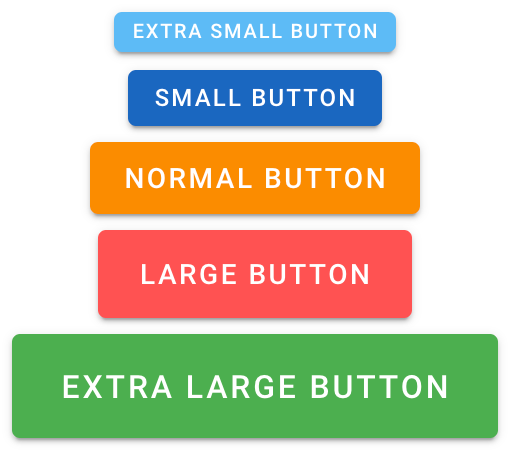
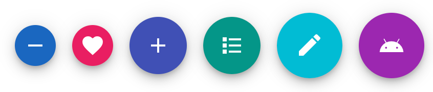
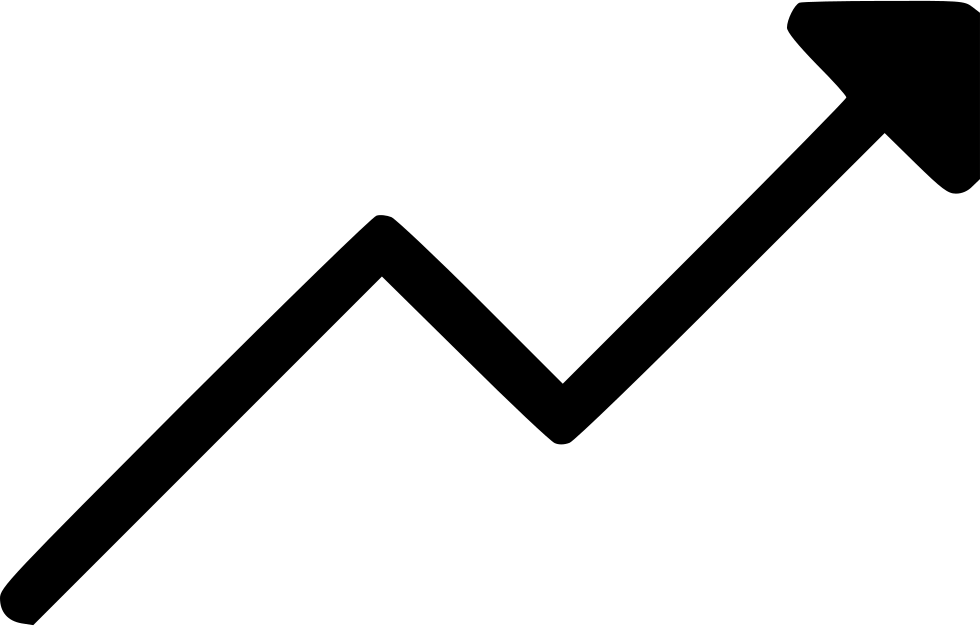

---
# try also 'default' to start simple
theme: seriph
# random image from a curated Unsplash collection by Anthony
# like them? see https://unsplash.com/collections/94734566/slidev
background: https://source.unsplash.com/collection/94734566/1920x1080
# apply any windi css classes to the current slide
class: 'text-center'
# https://sli.dev/custom/highlighters.html
highlighter: shiki
# some information about the slides, markdown enabled
info: |
  ## Slidev Starter Template
  Presentation slides for developers.
  
  Learn more at [Sli.dev](https://sli.dev)
---

# Intro to Vuetify

By: Austin Akers

<!--
The last comment block of each slide will be treated as slide notes. It will be visible and editable in Presenter Mode along with the slide. [Read more in the docs](https://sli.dev/guide/syntax.html#notes)
-->

---
layout: image-right
image: https://source.unsplash.com/collection/94734566/1920x1080
---

# Overview

- 📝 **Summary of Vuetify**
- 🛠 **Refactor an App**
- 🧑‍💻 **Tips for your Journey**

---

---

# Overview of Vuetify

- UI Library
- Material Design
- Quick to Learn

<!--  -->

<!--  -->

---
layout: image-right
image: src/assets/vuetify_logo.png
---

# Refactor an App

- Add Vuetify 3(alpha)
- Refactoring
- Basic Components
- Final Test

---

# Visit this link

## https://bit.ly/36O0pye

---

# Let's connect

- Twitter: @tweetmonster999
- LinkedIn: https://bit.ly/3hS2Dn6
- Github: BboyAkers

