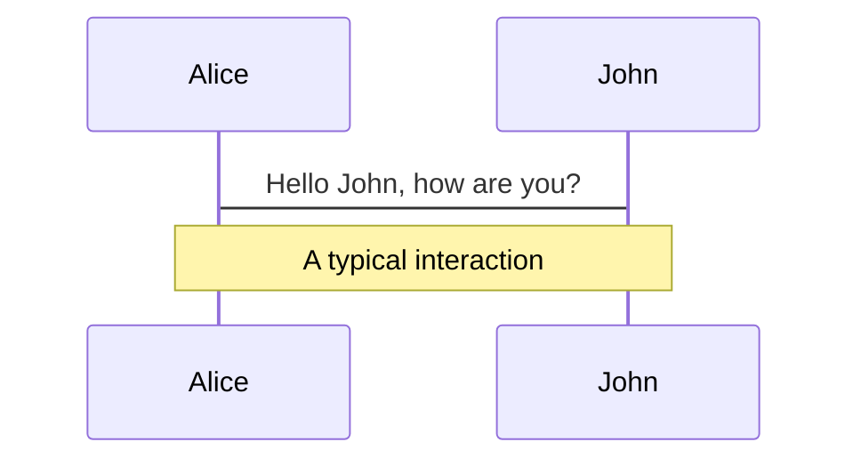
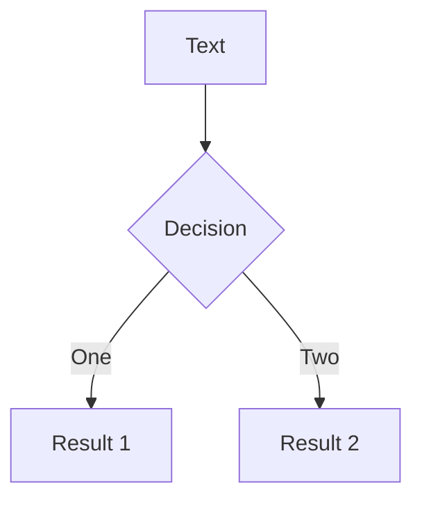

---
# try also 'default' to start simple
theme: seriph
# random image from a curated Unsplash collection by Anthony
# like them? see https://unsplash.com/collections/94734566/slidev
background: https://source.unsplash.com/collection/94734566/1920x1080
# apply any windi css classes to the current slide
class: 'text-center'
# https://sli.dev/custom/highlighters.html
highlighter: shiki
# some information about the slides, markdown enabled
info: |
  ## Slidev Starter Template
  Presentation slides for developers.
  
  Learn more at [Sli.dev](https://sli.dev)
---

# What's New in Vuetify 3

By: Austin Akers

<!--
The last comment block of each slide will be treated as slide notes. It will be visible and editable in Presenter Mode along with the slide. [Read more in the docs](https://sli.dev/guide/syntax.html#notes)
-->

---

# Overview
  
- 📝 **What is Vuetify?**
- 🛠 **Vuetiful Updates**
- 🧑‍💻 **Upgrading to v3**

---

# Let us Begin!

---

# What is Vuetify?

<div grid="~ cols-3 gap-2" m="-t-2">

<div>
UI Framework


</div>

<div>
Material Design

</div>

<div>
Quick to Learn
</div>

</div>

---
layout: image-right
image: https://source.unsplash.com/collection/94734566/1920x1080
---

# Vuetiful Updates

- Component Declaration
- Custom Icons
- Localization
- Theme
- Global Configuration

---
layout: image-right
image: https://source.unsplash.com/collection/94734566/1920x1080
---

# Component Declaration

<div grid="~ cols-3 gap-2" m="-t-2">

<div>
Card One (simplicity)

```html
<v-card
  density="comfortable"
  elevation="6"
  prepend-avatar="...jpg"
  title="Danger Noodle"
  subtitle="Noddle of Danger"
  text=""
/>
```
</div>

<div>
Card Two

```html
<v-card 
  density="comfortable"
  elevation="6"
>
  <v-card-item>
    <v-card-avatar image="..." />
  
  <v-card-header>
    <v-card-title>...</v-card-title>
    <v-card-subtitle>...</v-card-subtitle>
  </v-card-header>

  <v-card-text>...</v-card-text>

  </v-card-item>
</v-card>
```
</div>

<div>
Card Three

```html
<v-card 
  density="comfortable"
  elevation="6"
>

<template #title>Danger Noodle</template>

<template #subtitle>Noddle of Danger</template>

<template #text>...</template>

<template #append>...</template>

</v-card>
```
</div>

</div>
---

# Custom Icons

<div grid="~ cols-2 gap-4">
<div>

```html
<template>
  <v-app>
    <div class="ma-12 pa-12">
      <v-icon icon="mdi-vuetify" />
      <v-icon icon="fa:circle-outline" />
      <v-icon icon="vuetify" />
    </div>
  </v-app>
</template>
```

</div>
<div>


</div>
</div>


---

# Localization

<div grid="~ cols-2 gap-4">
<div>

```js
export default createVuetify({
  locale: {
    messages: {
      en,
      ar,
      sv,
      ja,
    },
  }
})
```

</div>
<div>


</div>
</div>

- Auto rtl and ltr support
- using vue-i18n

---

# Theme

- Themes
- Locale(i18n)
- Icons

---

# Global Configuration


<div grid="~ cols-2 gap-2" m="-t-2">

```js

export default createVuetify({
  defaults: {
    global: {
      density: 'compact',
    },
    VBtn: {
      color: 'primary',
    },
    VCard: {
      outlined: true,
    },
  }
})

```


</div>


---

# Animations

Animations are powered by [@vueuse/motion](https://motion.vueuse.org/).

```html
<div
  v-motion
  :initial="{ x: -80 }"
  :enter="{ x: 0 }">
  Slidev
</div>
```

<div class="w-60 relative mt-6">
  <div class="relative w-40 h-40">
    
    
    
  </div>

  <div 
    class="text-5xl absolute top-14 left-40 text-[#2B90B6] -z-1"
    v-motion
    :initial="{ x: -80, opacity: 0}"
    :enter="{ x: 0, opacity: 1, transition: { delay: 2000, duration: 1000 } }">
    Slidev
  </div>
</div>

<!-- vue script setup scripts can be directly used in markdown, and will only affects current page -->
<script setup lang="ts">
const final = {
  x: 0,
  y: 0,
  rotate: 0,
  scale: 1,
  transition: {
    type: 'spring',
    damping: 10,
    stiffness: 20,
    mass: 2
  }
}
</script>

<div 
  v-motion
  :initial="{ x:35, y: 40, opacity: 0}"
  :enter="{ y: 0, opacity: 1, transition: { delay: 3500 } }">
  
[Learn More](https://sli.dev/guide/animations.html#motion)

</div>

---

# LaTeX

LaTeX is supported out-of-box powered by [KaTeX](https://katex.org/).

<br>

Inline $\sqrt{3x-1}+(1+x)^2$

Block
$$
\begin{array}{c}

\nabla \times \vec{\mathbf{B}} -\, \frac1c\, \frac{\partial\vec{\mathbf{E}}}{\partial t} &
= \frac{4\pi}{c}\vec{\mathbf{j}}    \nabla \cdot \vec{\mathbf{E}} & = 4 \pi \rho \\

\nabla \times \vec{\mathbf{E}}\, +\, \frac1c\, \frac{\partial\vec{\mathbf{B}}}{\partial t} & = \vec{\mathbf{0}} \\

\nabla \cdot \vec{\mathbf{B}} & = 0

\end{array}
$$

<br>

[Learn more](https://sli.dev/guide/syntax#latex)

---

# Diagrams

You can create diagrams / graphs from textual descriptions, directly in your Markdown.

<div class="grid grid-cols-2 gap-4 pt-4 -mb-6">





</div>

[Learn More](https://sli.dev/guide/syntax.html#diagrams)


---
layout: center
class: text-center
---

# Learn More

[Documentations](https://sli.dev) / [GitHub Repo](https://github.com/slidevjs/slidev)
