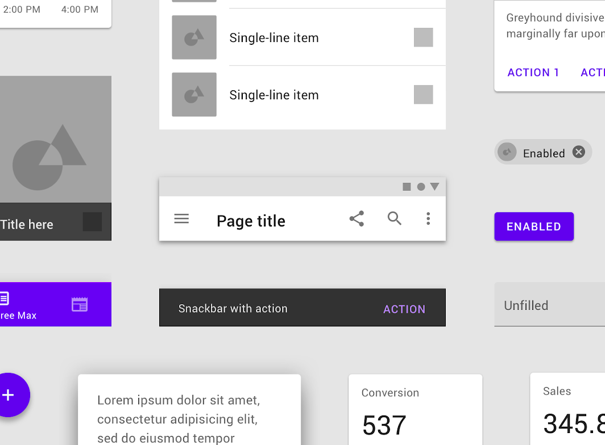

---
# try also 'default' to start simple
theme: seriph
# random image from a curated Unsplash collection by Anthony
# like them? see https://unsplash.com/collections/94734566/slidev
background: https://source.unsplash.com/collection/94734566/1920x1080
# apply any windi css classes to the current slide
class: 'text-center'
# https://sli.dev/custom/highlighters.html
highlighter: shiki
# some information about the slides, markdown enabled
info: |
  ## Slidev Starter Template
  Presentation slides for developers.
  
  Learn more at [Sli.dev](https://sli.dev)
---

# What's New in Vuetify 3

By: Austin Akers

<!--
The last comment block of each slide will be treated as slide notes. It will be visible and editable in Presenter Mode along with the slide. [Read more in the docs](https://sli.dev/guide/syntax.html#notes)
-->

---
layout: image-right
image: https://source.unsplash.com/collection/94734566/1920x1080
---


# Overview

- 📝 **Summary of Vuetify?**
- 🛠 **Vuetiful Updates**
- 🧑‍💻 **Upgrading to v3**

---


---

# Overview of Vuetify

<div grid="~ cols-2 gap-2" m="-t-2">

<div>

- UI Framework
- Material Design
- Quick to Learn

<!--  -->

</div>

<div>



<!--  -->

</div>

</div>
<style>
 img {
   margin-top: 25px;
 }
 ul{
   font-size: 1.2em;
 }
</style>

---
layout: image-right
image: src/assets/vuetify_logo.png
---

# Vuetiful Updates

- Component Declaration
- Custom Icons
- Localization
- Theme
- Global Configuration

---

# Component Declaration

<div grid="~ cols-2 gap-2" m="-t-2">

<div>

Option One

```html{all|4|5|6|7-9|all}
<v-card
  density="comfortable"
  elevation="6"
  prepend-avatar="src/assets/profile_pic.png"
  title="BboyAkers"
  subtitle="Software Engineer"
  text="I enjoy frontend development. 
        Outside of work I contribute to
        MetaMask, Vuetify, and freeCodeCamp Dallas."
/>
```
</div>

<div>


- Compact
- Simplicity
- Iteration on simple cards
</div>


</div>

---


# Component Declaration


<div grid="~ cols-2 gap-2" m="-t-2">

<div>

Option Two

```html{all|6-12|7|8-11|9|10|14-18|all}
<v-card 
  density="comfortable"
  elevation="6"
>
<v-card-item>
  <v-card-header>
    <v-card-avatar image="src/assets/profile_pic.png" />
    <v-card-header-text>
      <v-card-title>BboyAkers</v-card-title>
      <v-card-subtitle>Software Engineer</v-card-subtitle>
    </v-card-header-text>
  </v-card-header>

  <v-card-text>
    I enjoy frontend development. Outside of work 
    I contribute to MetaMask, Vuetify, 
    and freeCodeCamp Dallas.
  </v-card-text>
</v-card-item>
</v-card>
```
</div>

<div>


- Most Common
- More descriptive
- More customization

</div>

</div>
---


# Component Declaration


<div grid="~ cols-2 gap-2" m="-t-2">

<div>

Option Three

```html{all|5-14|5|7|9|10-14|all}
<v-card 
  density="comfortable"
  elevation="6"
>
  <v-card-avatar image="src/assets/vuetify_github_card.png" />

  <template #title>BboyAkers</template>

  <template #subtitle>Software Engineer</template>

  <template #text>
    I enjoy frontend development. Outside of work 
    I contribute to MetaMask, Vuetify, and freeCodeCamp Dallas.
  </template>

</v-card>
```
</div>

<div>


- Great median
- More concise than 'Option Two'
- Not sacrificing versatility compared to 'Option One'

</div>

</div>
---

# Custom Icons


<div grid="~ cols-2 gap-4">
<div>


```js
import { mdi, aliases } from '';
export default createVuetify({
  icons: {
    defaultSet: 'fa',
    aliases,
    sets: {
      fa,
      mdi,
    },
})
```

```html
<template>
  <v-app>
    <div class="ma-12 pa-12">
      <v-icon icon="mdi-vuetify" />
      <v-icon icon="fa:circle-outline" />
      <v-icon icon="vuetify" />
    </div>
  </v-app>
</template>
```


</div>
<div>

- Importing and declaration
- Easier to use custom icons
- Set default icon sets


</div>
</div>


---

# Localization

<div grid="~ cols-2 gap-4">
<div>

```js
import { ar, en } from 'vuetify/src/locale';
export default createVuetify({
  locale: {
    messages: {
      en,
      ar,
    }
  },
})
```

</div>
<div>


</div>
</div>

- Auto right to Left(RTL) support
- Using vue-i18n

---

# Theme
### Inject Themes inside our current theme
<div grid="~ cols-2 gap-4">

<div>

```html{all|2|2-12|13-20|all}
<v-container>
  <v-theme-provider theme="dark">
    <v-card>
      <v-card-text>
        Injected Dark Theme Card
      </v-card-text>

      <v-card-actions>
        <v-btn color="primary">Github</v-btn>
      </v-card-actions>
    </v-card>
  </v-theme-provider>
  <v-card>
    <v-card-text>
     Default Card Theme
    </v-card-text>
    <v-card-actions>
      <v-btn color="primary">Github</v-btn>
    </v-card-actions>
  </v-card>
</v-container>
```

</div>

<div>


</div>

</div>

---

# Global Configuration


<div grid="~ cols-2 gap-2" m="-t-2">

```js

export default createVuetify({
  defaults: {
    global: {
      density: 'compact',
    },
    VBtn: {
      color: 'primary',
    },
    VCard: {
      outlined: true,
    },
  }
})

```


</div>


---

# Upgrade/Testing?

<div grid="~ cols-2 gap-2" m="-t-2">

<div>

- Visit next.vuetifyjs.com
- Vue CLI 
  - **vue add vuetify** > **Vue 3** > **V3(alpha)**
- Vuetify ESLint Plugin
- Inside Terminal **vue create my-app -p vuetifyjs/preset**
</div>

<div>


</div>

</div>

---

# Let's connect

<div grid="~ cols-2">
<div>

- Twitter: @tweetmonster999
- LinkedIn: https://bit.ly/3hS2Dn6
- Github: BboyAkers

</div>
<div>


</div>
</div>

---

