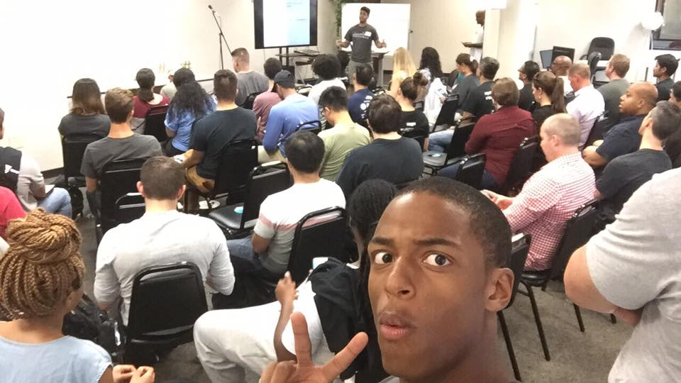
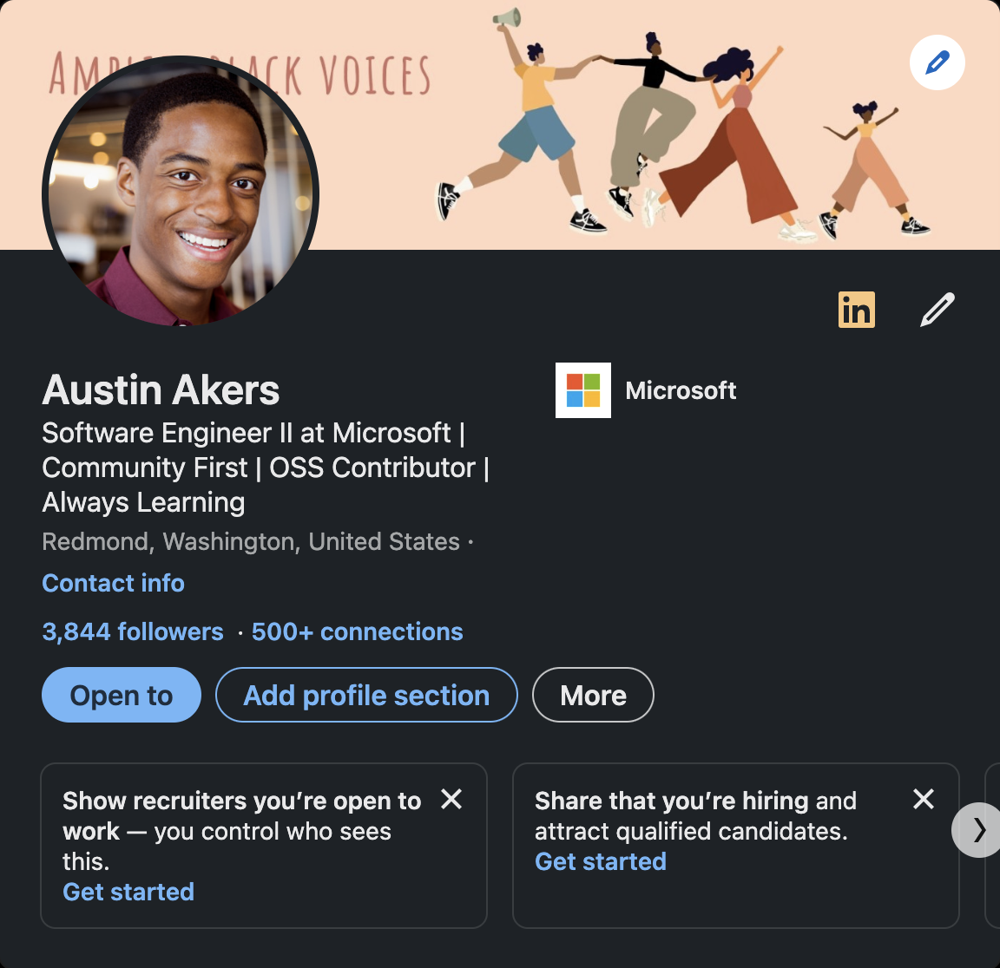

---
# try also 'default' to start simple
theme: default
# random image from a curated Unsplash collection by Anthony
# like them? see https://unsplash.com/collections/94734566/slidev
background: https://source.unsplash.com/collection/94734566/1920x1080
# apply any windi css classes to the current slide
class: 'text-center'
# https://sli.dev/custom/highlighters.html
highlighter: shiki
# show line numbers in code blocks
lineNumbers: false
# some information about the slides, markdown enabled
info: |
  ## Slidev Starter Template
  Presentation slides for developers.

  Learn more at [Sli.dev](https://sli.dev)
# persist drawings in exports and build
drawings:
  persist: false
# use UnoCSS (experimental)
css: unocss
---

# Tips For Building a Strong Junior Developer Portfolio

By: Austin Akers

---

# Overview

- 🎨 **Projects**

- 📝 **Blogging**

- 📝 **Leveraging Github**

<iframe src="https://giphy.com/embed/MRH15ebBQboUMedyks" width="480" height="480" frameBorder="0" class="giphy-embed" allowFullScreen></iframe>
<a href="https://giphy.com/gifs/foxhomeent-MRH15ebBQboUMedyks">via GIPHY</a>

---
layout: image-right
image: austinakers.com.png
---

# Projects

### Personal Website

-  A summary about you

-  A list of projects (Code + Demo)

-  How to contact you?

-  A blog?

-  Your Resume (optional)

 

### Type of Projects?

-  4-5 projects in total

-  2-3 mid-sized projects

-   1-2 larger projects

- Go beyond the basic projects (<a href="https://www.frontendmentor.io/">frontendmentor.io</a>)

-  Contributing to open source (Hacktober Fest)

---
layout: image-right
image: dev.to_dashboard.png
---

# Blogging

### Why?

- Documenting your journey

- Writing a tutorial

- Constantly learning

- Personal website, dev.to, medium, etc.

---
layout: image-right
image: GitHub-logo-2.png
---

# Leveraging Github

- Github Pages

- Github Projects

- Reference points

- Helps familiarize yourself with a standard dev workflow

---

# Summary

- Variety of well built out projects

- Blog

- Leverage Github

---

# Extra Tips

### Build a Network
 

### Have a Social Media Presence
 

 
 

---

# Connect

- Twitter: @tweetmonster999
- Github: BboyAkers
- LinkedIn: https://bit.ly/3hS2Dn6

