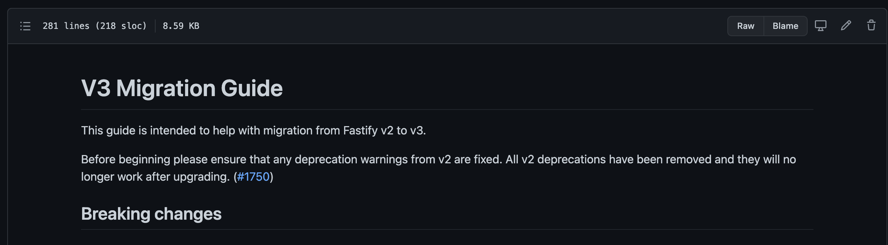

---
# try also 'default' to start simple
theme: seriph
# random image from a curated Unsplash collection by Anthony
# like them? see https://unsplash.com/collections/94734566/slidev
background: https://source.unsplash.com/collection/94734566/1920x1080
# apply any windi css classes to the current slide
class: 'text-center'
# https://sli.dev/custom/highlighters.html
highlighter: shiki
# some information about the slides, markdown enabled
info: |
  ## Slidev Starter Template
  Presentation slides for developers.
  
  Learn more at [Sli.dev](https://sli.dev)
---

# Upgrading to Fastify 3

Lessons learned from Upgrading Fastify **2.15.0** to **3.x.x**

<div class="pt-12">
  <span @click="$slidev.nav.next" class="px-2 p-1 rounded cursor-pointer" hover="bg-white bg-opacity-10">
    by Austin Akers
  </span>
</div>

<a href="https://github.com/slidevjs/slidev" target="_blank" alt="GitHub"
  class="abs-br m-6 text-xl icon-btn opacity-50 !border-none !hover:text-white">
  <carbon-logo-github />
</a>

<!--
The last comment block of each slide will be treated as slide notes. It will be visible and editable in Presenter Mode along with the slide. [Read more in the docs](https://sli.dev/guide/syntax.html#notes)
-->

---

# Overview

Upgrading our Docs Render 🛠

We will be covering:
- 📝 **Backstory**
- 🎨 **5 Lessons**
- 🧑‍💻 **Migration Summary**
<br>
<br>

<style>
h1 {
  background-color: #2B90B6;
  background-image: linear-gradient(45deg, #4EC5D4 10%, #146b8c 20%);
  background-size: 100%;
  -webkit-background-clip: text;
  -moz-background-clip: text;
  -webkit-text-fill-color: transparent; 
  -moz-text-fill-color: transparent;
}
</style>

<!--
Over the course of this presentation, we’ll be going over how upgraded one of our backend service docs render, which is a service that improves the rendering and versatility of what we’re able to do for the Microsoft documentation. So we’ll give a brief backstory/disclaimer about our codebase, then go over the 5 lessons/tips learned which is the heart of the presentation, and last but no least we’ll then give a brief summary of how I felt the migration went.
-->

---

# Backstory

<small>Disclaimer</small>

Our Codebase before the upgrade:

  - ✅ TypeScript
  - ✅ Not large <small>*Relative to an enterprise codebase</small> 
  - ✅ Dependencies are all updated

---

# Let's Dive In


<style>
div {
  text-align: center;
}

img {
  display: inline-block;
}

</style>

---

# Lesson One

Understand the breaking changes
- Major Version === Breaking Changes
- Document end to end process 
- Assess possible pain points

<div grid="~ cols-2" style="margin-top: 50px">

<div>



</div>
<div>


</div>
</div>
---

# Lesson Two

<div grid="~ cols-2">  
<div>

Fix the foundation and go upwards

- Several tries
- Tackle upgrade incrementally
- Less overwhelming


</div>
<div>

```ts {all|1}
fastify.register(render);
fastify.register(engine);
fastify.register(auth);
fastify.register(content);
fastify.register(context);
fastify.register(locale);
fastify.register(error);
```

</div>

</div>

<!--
When it upgrading to Fastify 3, there were many breaking changes. when I joined the team and Microsoft, I took the initative of Version bumping and trying to tackle the large list of errors. Turns out that wasn't the best approach. In other words it took me several tries to tackle this. What I ended up doing was stripping down the app to it's basic functionality fix the foundation and tackle the upgrade in increments. Fastify made it easiser because it has a plugin centric architecture. As you can see to the right are some of the plugins we've created, I narrowed down the functionality to a core plugin of our app and went onward from there. Which brings me to a point inside of this. The Plugin System
-->

---

# Plugin System

- Has descriptive error messages
- Function declarations concise
- Easier to understand

<div grid="~ cols-2">

<div>
v2

```ts {all|1-4}
export default fp(function (
  fastify: FastifyInstance,
  _options: fp.PluginOptions,
  done: fp.nextCallback
){
  // code here
});
```

</div>

<div>
v3

```ts {all|1-2}
const appRenderConfig: FastifyPluginCallback =
(fastify, _, done) => {
  // code here
}
// more code

export default fp(appRenderConfig);
```

</div>

</div>

<!-- The plugin system changes were probably my favorite. When upgrading the error messages around plugins were quite helpful. After upgrading our functions became more conscise and easier to understand. Let's take a look. But looking at this, even though the error messages were descriptive, there was still a level of disconnect on my end on being able to truly understand how certain changes worked in the upgrade. Which brings me to my next lesson, which is also a great point of reference. -->

---

# Lesson Three

Reference Fastify Test Cases

- Migration guide had limited information
- See basic implementations of code
- Skeleton for my function

plugin.test-d.ts:

```ts {all|2|6}
// Testing FastifyPluginAsync
const testPluginAsync: FastifyPluginAsync = async function(instance, opts) { }
expectAssignable<FastifyInstance>(fastify().register(testPluginAsync, {}))

// Testing FastifyPluginCallback
const testPluginCallback: FastifyPluginCallback = function (instance, opts, done) { }
expectAssignable<FastifyInstance>(fastify().register(testPluginCallback, {}))
```

---

# Example


plugin.test-d.ts:

```ts
// Testing FastifyPluginAsync
const testPluginAsync: FastifyPluginAsync = async function(instance, opts) { }
```
<div grid="~ cols-2">

<div>
v2

```ts {all|1|6|7|all}
const siteRoutes: Plugin<
  http.Server,
  http.IncomingMessage
  http.ServerResponse,
  RegisterOptions
> = async function(
    fastify: FastifyInstance
  ): Promise<void> {
    // Site Route Code
  }

```

</div>

<div>
v3

```ts {all|1|all}
const siteRoutes: FastifyPluginAsync = async function(
    fastify: FastifyInstance
  ): Promise<void> {
    // Site Route Code
  }


```
</div>
</div>

---

# Lesson Four
TypeScript, TypeScript, TypeScript..... 

- Expidited workflow
- Better disect errors
- Lowered the bell curve
<div grid="~ cols-2">

<div>

```ts {all|1-7}
  interface Logger {
    fatal(msg: string, ...args: any[]): void;
    fatal(obj: {}, msg?: string, ...args: any[]): void;
    error(msg: string, ...args: any[]): void;
    // ......
  }

```

</div>
</div>

---

# Lesson Five
More Test Covereage
- 70-80% coverage
- Instill more confidence after changes
- Consistency
<div grid="~ cols-2">

<div>

```ts
tap.test('write more tests', t => {
  // Insert code coverage
  // TDD is pretty awesome
  t.end();
});


```

</div>
<div>

```bash

Suites:   1 passed, 1 of 1 completed
Asserts:  1 passed, of 1
Time:     1s
----------|----------|----------|----------|----------|
File      |  % Stmts | % Branch |  % Funcs |  % Lines |
----------|----------|----------|----------|----------|
All files |      100 |      100 |      100 |      100 |
----------|----------|----------|----------|----------|

```

</div>
</div>

---

# Migration Successful

<div grid="~ cols-2">
<div>

What made it successful?
- ✅ Fastify 3
- ✅ No Console Errors
- ✅ Cleaner & Concise 
- ✅ Many test cases didn't break
- ✅ Deployment was smooth

</div>
<div>


</div>
</div>
---

# Reccomendation

- Document changes & assess codebase
- Work bottom to top
- Reference Fastify source code & test cases
- Take advantage of TypeScript
- Test Covereages
---

# Let's connect

<div grid="~ cols-2">
<div>

- Twitter: @tweetmonster999
- LinkedIn: https://bit.ly/3hS2Dn6
- Github: BboyAkers

</div>
<div>


</div>
</div>
---
