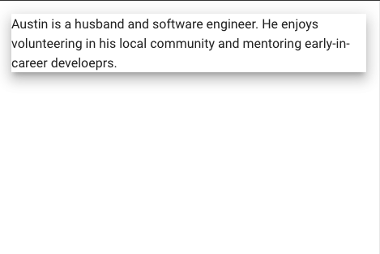

# Building a Vuetify Component

By Austin Akers

---

# Overview?

- 📝 **Quick example**
- 📝 **Why?**
- 🧑‍💻 **Put it into practice**
    - Overview Vuetify repo
    - Build our component
    - See our component
- 🤹 **Q&A**


**Disclaimer: Dual screen recommended for presentation and coding

<!--
- Change 'Dive Into The Codebase' to something else
- Add sub-bullets under 'Dive Into The Codebase'
- Give disclaimer* about needing dual screen for following along
-->

<style>
h1 {
  background-color: #2B90B6;
  background-image: linear-gradient(45deg, #4EC5D4 10%, #146b8c 20%);
  background-size: 100%;
  -webkit-background-clip: text;
  -moz-background-clip: text;
  -webkit-text-fill-color: transparent;
  -moz-text-fill-color: transparent;
}
</style>

<!--
Here is another comment.
-->

---

# Quick example

<div class="grid grid-cols-2 gap-4">

<div>

```html
<v-app>
  <v-container>
    <!-- Our Component -->
    <v-basic-component elevation="4"> 
      Austin is a husband and software engineer. He enjoys 
      volunteering in his local community and 
      mentoring early-in-career develoeprs.
    </v-basic-component>
    <!-- /Our Component -->
  </v-container>
</v-app>
```

</div>

<div>
  
  

</div>

</div>

<!-- Change Quick exmaple to end result/ finished product of our component of the presentation -->
---

# Why?

<div v-click="1">

- Improve tool knowledge

</div>

<div v-click="2">

- Deeper level comfort when debugging

</div>

<div v-click="3">

- Understanding how to navigate the Vuetify project

</div>

---

# Live Coding

Link to Follow along:

https://bit.ly/3oQC8nT


<footer-link/>

---
layout: center

---

# Put it into practice

---

# Put it into practice

<div v-click="1">

- Overview Vuetify repo

</div>
<div v-click="2">

- Build our component

</div>
<div v-click="3">

- See our component

</div>
<footer-link/>
---
layout: image-right

image: images/vuetifyjs_vuetify_base_repo.png
---

# Overview Vuetify Repo


<div v-click="1">

- `scripts/` -> deploying, linting rules, ect.

</div>

<div v-click="2">

- `packages/` -> api, documentation, vuetify

</div>

<div v-click="3">

- `templates/` -> components, and tests

</div>

<arrow v-click="4" x1="430" y1="150" x2="500" y2="150" color="#564" width="3" arrowSize="1" />
<footer-link/>

<!-- Put red boxes around the folders -->
---
layout: center

---

# Build our component

---

# Navigate to our folder
<div class="grid grid-cols-3 gap-4">

<div v-click="1">


</div>
<div v-click="3">

 `vuetify/` -> `src/` -> `components/`

</div>
<div v-click="5">


</div>
</div>

<arrow v-click="2" x1="300" y1="140" x2="350" y2="140" color="#564" width="3" arrowSize="1" />
<arrow v-click="4" x1="580" y1="140" x2="630" y2="140" color="#564" width="3" arrowSize="1" />
<footer-link/>
---

# Our Folder & Files


<div v-click="1">


</div>
<arrow v-click="2" x1="100" y1="270" x2="160" y2="270" color="#564" width="3" arrowSize="1" />
<footer-link/>
---


# Different Sections

<div class="grid grid-cols-2 gap-4">

<div>

- Components -> Importing other components

- Composables -> Properties for our component

- Utilities -> Baseline and glue

- Types -> Types for our component

- Our Component -> Bring it all together


</div>

<div>

```tsx {all|1|3|5|7|9}
// Components

// Composables

// Utilities

// Types

// Our Component
```

</div>
</div>
<footer-link/>
---

# Utilities

<div v-click="1">

- `genericComponent` - Foundation for us to create a component in Vuetify

</div>
<div v-click="2">

- `useRender` - Vue 3 `.render` function to add this to our Virtual DOM Tree

</div>

<div v-click="3">

- `PropsFactory` - Makes it easier for us to override default values via props (ex. elevation, border, ect.)

</div>
<br/>
<br/>
<div v-click="4">

```tsx
// Components

// Composables

// Utilities
import { genericComponent, propsFactory, useRender } from "@/util";

// Types

// Our Component
```

</div>

<footer-link/>

---

# Composables


<div v-click="1">

- `makeElevationProps` and `useElevation` - Modify elevation of the component

</div>
<br />
<div v-click="2">

```tsx{all|4}
// Components

// Composables
import { makeElevationProps, useElevation } from "@/composables/elevation";

// Utilities
import { genericComponent, propsFactory, useRender } from "@/util";

// Types

// Our Component
```

</div>
<div v-click="3">

```ts
export const makeVBasicComponentProps = propsFactory(
  {
    text: String,

    ...makeElevationProps(),
  },
  "v-basic-component"
);
```

</div>

<footer-link/>

---

# Types

<div v-click="1">

- Types for our slots

</div>
<br />
<div v-click="2">

```ts
// Components

// Composables
import { makeElevationProps, useElevation } from "@/composables/elevation";

// Utilities
import { genericComponent, propsFactory, useRender } from "@/util";

// Types
export type VBasicComponentSlots = {
  default: [];
  text: [];
};

// ect....
```

</div>
<footer-link />
---

# Bring it all together!

Create our Vuetify Basic Component

```tsx{all|1,9|2|4|6,8|all}
export const VBasicComponent = genericComponent<VBasicComponentSlots>()({
  name: "VBasicComponent",

  props: makeVBasicComponentProps(),

  setup(){
    // More code here....
  },
});
```

<footer-link />
---

# Set up our setup()

Creating and rendering the core of our component

```tsx{all|1,15|3-5|7-14|all}
setup(props, { slots }){

  // Classes
  const { elevationClasses } = useElevation(props);

  // Render
  useRender(() => {

    return (
      <div class={[elevationClasses.value]}>
        // More code here....
      </div>
    );
  });
},
```

<footer-link />
---

# Conditional rendering

Rendering our text

```tsx{all|3|7-11|all}
// Render
useRender(() => {
  const hasText = !!(props.text || slots.text);

  return (
    <div class={[elevationClasses.value]}>
      {hasText ? (
        <div>{slots.text?.() ?? props.text}</div>
      ) : (
        <div>{slots.default?.()}</div>
      )}
    </div>
  );
});
```

<footer-link />
---

# Summary

We created a basic component

- Utilities
- Composables
- Props
- Slots
- Exported

<footer-link />
---

# Connect

- Twitter: @tweetmonster999
- Github: BboyAkers
- LinkedIn: https://bit.ly/3hS2Dn6
- Website: https://www.austinakers.com/
- ❤️ Support Vuetify: https://vuetifyjs.com/
