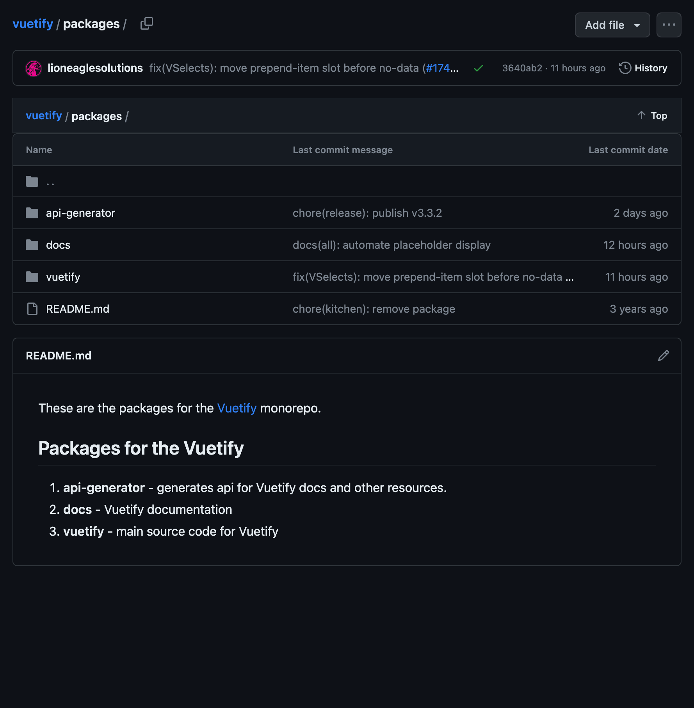
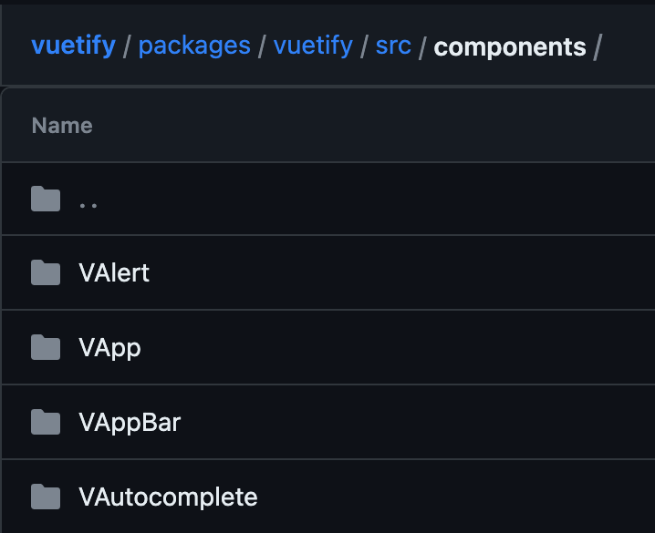
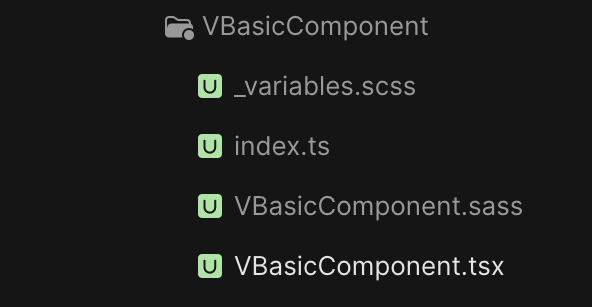

# Building a Vuetify Component

By Austin Akers

<div class="pt-12">
  <span @click="$slidev.nav.next" class="px-2 py-1 rounded cursor-pointer" hover="bg-white bg-opacity-10">
    Press Space for next page <carbon:arrow-right class="inline"/>
  </span>
</div>

---

# Overview?

- 📝 **Why?**
- 🧑‍💻 **Dive Into The Codebase**
- 🤹 **Q&A**

<!--
You can have `style` tag in markdown to override the style for the current page.
Learn more: https://sli.dev/guide/syntax#embedded-styles
-->

<style>
h1 {
  background-color: #2B90B6;
  background-image: linear-gradient(45deg, #4EC5D4 10%, #146b8c 20%);
  background-size: 100%;
  -webkit-background-clip: text;
  -moz-background-clip: text;
  -webkit-text-fill-color: transparent;
  -moz-text-fill-color: transparent;
}
</style>

<!--
Here is another comment.
-->

---

# Why?

<div v-click="1">

- Satify my curiousity itch

</div>

<div v-click="2">

- Improve tool knowledge

</div>

<div v-click="3">

- Deeper level comfort

</div>

<div v-click="4">

- Lower the intimidation factor contributing

</div>

---

# Dive Into The Codebase

<div v-click="1">

- Overview Vuetify repo

</div>
<div v-click="2">

- Build our component

</div>
<div v-click="3">

- See our component

</div>
---
layout: image-right

image: images/vuetifyjs_vuetify_base_repo.png
---

# Overview Vuetify Repo

<div v-click="1">

- `packages/` -> api, documentation, vuetify

</div>
<div v-click="2">

- `patches/` -> patch caching 

</div>

<div v-click="3">

- `scripts/` -> deploying, linting rules, ect.

</div>
<div v-click="4">

- `templates/` -> components, and tests

</div>

<arrow v-click="5" x1="420" y1="150" x2="500" y2="150" color="#564" width="3" arrowSize="1" />

---

# Inside Packages
<div class="grid grid-cols-3 gap-4">

<div v-click="1">



</div>
<div v-click="3">

 `vuetify/` -> `src/` -> `components/`

</div>
<div v-click="5">



</div>
</div>

<arrow v-click="2" x1="300" y1="140" x2="350" y2="140" color="#564" width="3" arrowSize="1" />
<arrow v-click="4" x1="580" y1="140" x2="630" y2="140" color="#564" width="3" arrowSize="1" />

---

# Create Folder & Files

<div class="grid grid-cols-2 gap-4">

<div v-click="1">

- `VBasicComponent/`
  - `_variables.scss`
  - `index.ts`
  - `VBasicComponent.sass`
  - `VBasicComponent.tsx`

</div>

<div v-click="2">



</div>

</div>

<arrow v-click="3" x1="550" y1="270" x2="610" y2="270" color="#564" width="3" arrowSize="1" />

---

# Live Coding

Link to Follow along:

Insert link before presenting

---

# Different Sections

<div class="grid grid-cols-2 gap-4">

<div>

- Components -> Importing other components

- Composables -> Properties for our components

- Utilities -> Basline and glue

- Types -> Types for our component

- Our Component -> Bring it all together


</div>

<div>

```tsx {all|1|3|5|7|9}
// Components

// Composables

// Utilities

// Types

// Our Component
```

</div>
</div>

---

## layout: end
