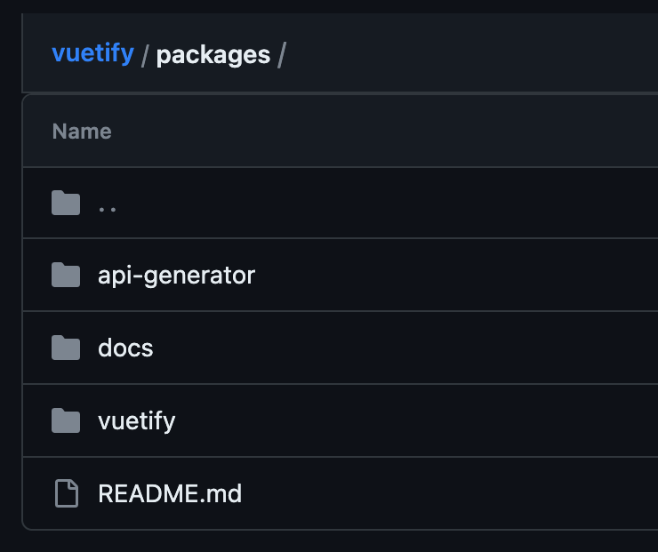

# Building a Vuetify Component

By Austin Akers

---

# Overview?

- 📝 **Why?**
- 🧑‍💻 **Dive Into The Codebase**
- 🤹 **Q&A**

<!--
You can have `style` tag in markdown to override the style for the current page.
Learn more: https://sli.dev/guide/syntax#embedded-styles
-->

<style>
h1 {
  background-color: #2B90B6;
  background-image: linear-gradient(45deg, #4EC5D4 10%, #146b8c 20%);
  background-size: 100%;
  -webkit-background-clip: text;
  -moz-background-clip: text;
  -webkit-text-fill-color: transparent;
  -moz-text-fill-color: transparent;
}
</style>

<!--
Here is another comment.
-->

---

# Quick Example

<div class="grid grid-cols-2 gap-4">

<div>

```html
<v-card class="mx-auto" width="400" elevation="10">
  <v-img
    class="mx-auto"
    height="300px"
    cover
    src="images/austin_akers.jpeg"
  ></v-img>
  <v-card-title>Austin Akers</v-card-title>
  <v-card-subtitle>
    Senior Software Engineer @ Spring Health
  </v-card-subtitle>
  <v-card-text>
    Austin is a husband and software engineer. He enjoys 
    volunteering in his local community and mentoring 
    young developers.
  </v-card-text>
</v-card>
```

</div>

<div>
  
  

</div>

</div>
---

# Why?

<div v-click="1">

- Satify my curiousity itch

</div>

<div v-click="2">

- Improve tool knowledge

</div>

<div v-click="3">

- Deeper level comfort

</div>

<div v-click="4">

- Lower the intimidation factor contributing

</div>

---

# Live Coding

Link to Follow along:

https://bit.ly/3oQC8nT


<footer-link/>

---

# Dive Into The Codebase

<div v-click="1">

- Overview Vuetify repo

</div>
<div v-click="2">

- Build our component

</div>
<div v-click="3">

- See our component

</div>
<footer-link/>
---
layout: image-right

image: images/vuetifyjs_vuetify_base_repo.png
---

# Overview Vuetify Repo

<div v-click="1">

- `packages/` -> api, documentation, vuetify

</div>
<div v-click="2">

- `patches/` -> patch caching 

</div>

<div v-click="3">

- `scripts/` -> deploying, linting rules, ect.

</div>
<div v-click="4">

- `templates/` -> components, and tests

</div>

<arrow v-click="5" x1="420" y1="150" x2="500" y2="150" color="#564" width="3" arrowSize="1" />
<footer-link/>
---

# Inside Packages
<div class="grid grid-cols-3 gap-4">

<div v-click="1">



</div>
<div v-click="3">

 `vuetify/` -> `src/` -> `components/`

</div>
<div v-click="5">


</div>
</div>

<arrow v-click="2" x1="300" y1="140" x2="350" y2="140" color="#564" width="3" arrowSize="1" />
<arrow v-click="4" x1="580" y1="140" x2="630" y2="140" color="#564" width="3" arrowSize="1" />
<footer-link/>
---

# Create Folder & Files

<div class="grid grid-cols-2 gap-4">

<div v-click="1">

- `VBasicComponent/`
  - `_variables.scss`
  - `index.ts`
  - `VBasicComponent.sass`
  - `VBasicComponent.tsx`

</div>

<div v-click="2">


</div>

</div>

<arrow v-click="3" x1="550" y1="270" x2="610" y2="270" color="#564" width="3" arrowSize="1" />
<footer-link/>
---


# Different Sections

<div class="grid grid-cols-2 gap-4">

<div>

- Components -> Importing other components

- Composables -> Properties for our components

- Utilities -> Baseline and glue

- Types -> Types for our component

- Our Component -> Bring it all together


</div>

<div>

```tsx {all|1|3|5|7|9}
// Components

// Composables

// Utilities

// Types

// Our Component
```

</div>
</div>
<footer-link/>
---

# Utilities

<div v-click="1">

- `genericComponent` - Foundation for us to create a component in Vuetify

</div>
<div v-click="2">

- `useRender` - Vue 3 `.render` function to add this to our Virtual DOM Tree

</div>

<div v-click="3">

- `PropsFactory` - Makes it easier for us to override default values via props (ex. elevation, border, ect.)

</div>
<br/>
<br/>
<div v-click="4">

```ts
// Utilities
import { genericComponent, propsFactory, useRender } from "@/util";
```

</div>

<footer-link/>

---

# Composables


<div v-click="1">

- `makeElevationProps` and `useElevation` - Modify elevation of the component

</div>
<div v-click="2">

- `makeBorderProps` and `useBorder` - Modify the border of the component

</div>
<br />
<br />
<div v-click="3">

```ts
// Composables
import { makeElevationProps, useElevation } from "@/composables/elevation";
import { makeBorderProps, useBorder } from "@/composables/border";
```

</div>
<div v-click="4">

```ts
export const makeVBasicComponentProps = propsFactory(
  {
    text: String,

    ...makeElevationProps(),
    ...makeBorderProps(),
  },
  "v-basic-component"
);
```

</div>

<footer-link/>

---

# Types

<div v-click="1">

- Types for our slots

</div>
<br />
<div v-click="2">

```ts
export type VBasicComponentSlots = {
  default: [];
  text: [];
};
```

</div>
<footer-link />
---

# Bring it all together!

- Props
- Slots
- Minor touches
- Export

---

# Summary

We created a basic component

- Utilities
- Composables
- Props
- Slots
- Exported and Tested

---

# Connect

- Twitter: @tweetmonster999
- Github: BboyAkers
- LinkedIn: https://bit.ly/3hS2Dn6
