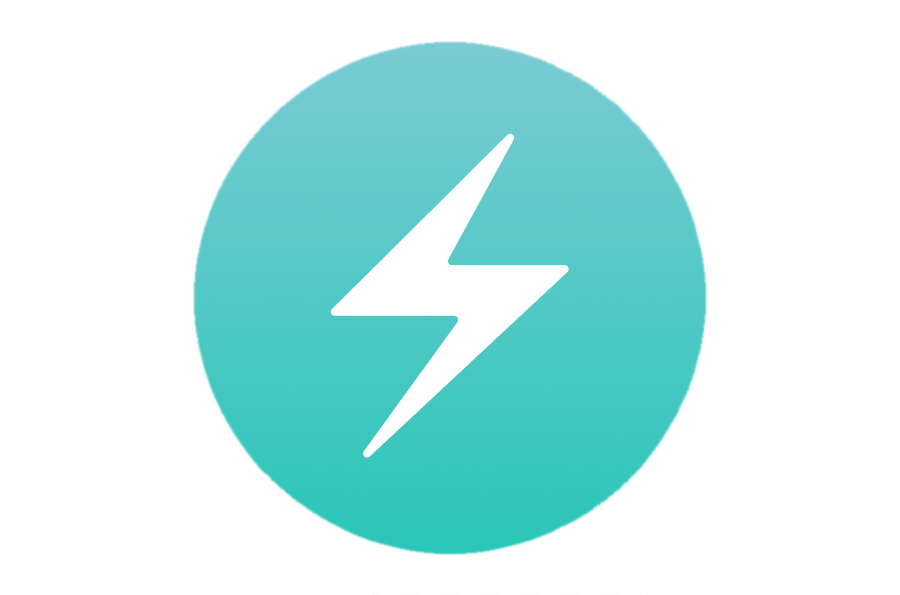
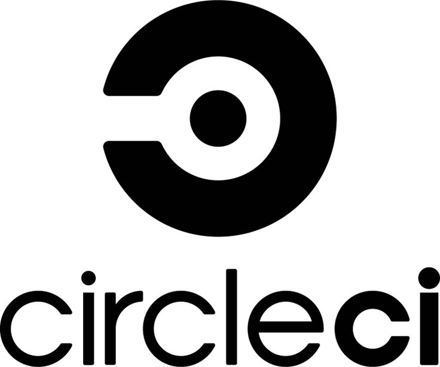

---
# try also 'default' to start simple
theme: seriph
# random image from a curated Unsplash collection by Anthony
# like them? see https://unsplash.com/collections/94734566/slidev
background: https://cover.sli.dev
# some information about your slides, markdown enabled
title: Contributing to a TypeScript Monorepo Migration
info: |
  ## Contributing to a TypeScript Monorepo Migration
  By Austin Akers

  Learn more at [Sli.dev](https://sli.dev)
# apply any unocss classes to the current slide
class: text-center
# https://sli.dev/custom/highlighters.html
highlighter: shiki
# https://sli.dev/guide/drawing
drawings:
  persist: false
# slide transition: https://sli.dev/guide/animations#slide-transitions
transition: slide-left
# enable MDC Syntax: https://sli.dev/guide/syntax#mdc-syntax
mdc: true
---

# Contributing to a TypeScript Monorepo Migration

By Austin Akers

<!--
The last comment block of each slide will be treated as slide notes. It will be visible and editable in Presenter Mode along with the slide. [Read more in the docs](https://sli.dev/guide/syntax.html#notes)
-->

---
transition: fade-out
---

# Overview

What to expect.

- 👨🏿‍💻 **Introduction** - Who am I?
- 📖 **Backstory** - Why?
- 📝 **4 Lessons** - What I learned.
- 🤹 **Outro** - Let's connect!

<br>
<br>


<!--
You can have `style` tag in markdown to override the style for the current page.
Learn more: https://sli.dev/guide/syntax#embedded-styles
-->

<!--
Here is another comment.
-->

---
transition: slide-up
level: 2
---

# 👨🏿‍💻 Introduction

<div class="grid grid-cols-2">
<div>

### Austin Akers
<div v-click="1">

- Husband & Father 👨🏾‍❤️‍👩🏾

</div>
<div v-click="2">

- Senior Software Engineer @ 

</div>
<div v-click="3">

- Spending time with family

</div>
<div v-click="4">

- Learning & Contributing to Open Source

</div>
<div v-click="5">

- Dancing (Bboy)

</div>
<div v-click="6">

- Cello

</div>
<div v-click="7">

- Muay Thai

</div>

</div>
<div>


</div>
</div>

---
layout: center
class: text-center
---

# 4 Lessons Learned

---
layout: two-cols
layoutClass: gap-16
---

# Lesson One

Underestimating the people component

<div v-click="1">

- TypeScript vs JS + JSDoc

</div>


<div class="grid grid-cols-[200px_200px_200px] gap-8" styles="width: 500px">
<div>
<p v-click="2">Categories:</p>
<p v-click="2" style="padding-bottom: 6px; margin-top: 0px; margin-bottom: 8px">Faster onboarding</p>
<p v-click="3" style="padding-bottom: 6px; margin-top: 0px; margin-bottom: 8px">Easier to refactor</p>
<p v-click="4" style="padding-bottom: 6px; margin-top: 0px; margin-bottom: 8px">Easier to debug</p>
<p v-click="5" style="padding-bottom: 6px; margin-top: 0px; margin-bottom: 8px">Easier to learn</p>
<p v-click="6" style="padding-bottom: 6px; margin-top: 0px; margin-bottom: 8px">Faster compilation</p>
</div>
<div>

<p v-click="2">TypeScript</p>

<!-- Faster onboarding -->

<!-- Easier to refactor -->

<!-- Easier to debug -->

<!-- Easier to learn -->

<!-- Faster compilation -->

</div>
<div>

<p v-click="2">JS + JSDoc</p>
<!-- Faster onboarding -->

<!-- Easier to refactor -->

<!-- Easier to debug -->

<!-- Easier to learn -->

<!-- Faster compilation -->


</div>
</div>


---
image: https://cover.sli.dev
---

# Lesson Two

Understanding Migration Trade-offs

<div class="grid grid-cols-2 gap-8">
<div v-click="1">

Progressive Migration
```ts
{
  "compilerOptions": {
    "outDir": "./built",
    "allowJs": true,
    "target": "es5"
  },
  "include": ["./src/**/*"]
}
```
<br>
<Arrow x1="150" y1="410" x2="250" y2="410" />


</div>

<div v-click="2">

What layers do we focus on?

<div v-click="3">

- Business Logic


</div>

<div v-click="4">

- Component Library

</div>
<div v-click="5">

- APIs

```ts
const { data, loading, error } = 
  useQuery<FetchUserData>(FETCH_USER);

const userId = data.id;
// ...
```
</div>
</div>
</div>

---
level: 2
---

# Lesson Three
Renaming files from `.jsx` to `.tsx`
<div class="grid grid-cols-3 gap-4">
<div v-click="1">

Add **type** information to `.jsx` files

```js
/**
 * This component renders a welcome to the user.
 *
 * @param {string} name The user's name.
 * @returns {ReactNode} React element rendering a welcome to the user.
 */
const WelcomeBanner = ({ name }) => {
  return <h1>Welcome, {name}!</h1>;
}
```

</div>
<div v-click="2">

Where to place our types?
```
example-app
|-- public/
|-- src/
|   |-- assets/
|   |-- store/
|   |   `-- user.ts
|   |-- shared/
|   |   `-- components/
|   `-- index.ts
|-- features/
|   `-- Authentication/
|       `-- Signup/
|           |-- hooks/
|           |-- queries/
|           |-- view/
|           `-- helpers/
|-- .gitignore
`-- .......
```
</div>
<div v-click="3">

Tests are VERY helpful
```ts
describe("Register component", () => {
  test('testing' () => {
    // ........
  })
});
```
</div>
</div>
---

# Lesson Four
Leveraging tooling

- ESLint & MegaLinter
- Prettier
- Copilot (fancy auto-complete)




---
layout: center
class: text-center
---

# Learn More

[Documentations](https://sli.dev) · [GitHub](https://github.com/slidevjs/slidev) · [Showcases](https://sli.dev/showcases.html)
