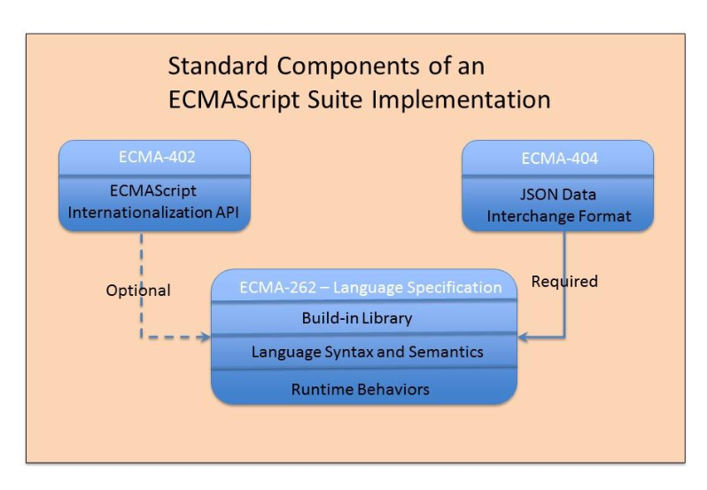

---
# You can also start simply with 'default'
theme: seriph
# random image from a curated Unsplash collection by Anthony
# like them? see https://unsplash.com/collections/94734566/slidev
background: https://cover.sli.dev
# some information about your slides (markdown enabled)
title: Welcome to Slidev
info: |
  ## Slidev Starter Template
  Presentation slides for developers.

  Learn more at [Sli.dev](https://sli.dev)
# apply unocss classes to the current slide
class: text-center
# https://sli.dev/features/drawing
drawings:
  persist: false
# slide transition: https://sli.dev/guide/animations.html#slide-transitions
transition: slide-left
# enable MDC Syntax: https://sli.dev/features/mdc
mdc: true
---

# Demystifying the ECMAScript&reg; Specification

By: Austin Akers

<!--
The last comment block of each slide will be treated as slide notes. It will be visible and editable in Presenter Mode along with the slide. [Read more in the docs](https://sli.dev/guide/syntax.html#notes)
-->

---
transition: fade-out
---

# Introduction

### Austin Akers

- Husband & Father 👨🏾‍❤️‍👩🏾

- Senior Software Engineer @ 

- Spending time with family

- Learning & Contributing to Open Source

- Dancing (Bboy)

- Cello

- Muay Thai

---
transition: slide-up
level: 1
---

# Overview

- Why read the ECMAScript Specification?
- How to approach the Specification?
- Writing a polyfill
- Summary
- Q&A

---

---

# Why read the ECMAScript Specification?

Understand the language

Challenges our thinking

 Being intentional writing code

<!-- 
- Helps us understand the innards of the language
- Challenges our way of thinking(abstractions)
- Encourages us to be more intentional writing code
 -->

---
transition: fade-out
---

# How to approach the Specification?
 1. Create a list of commonly used parts of the language
 2. Start small, find the smallest spec
 3. Read the notes of each method first
 4. Read it like pseudo code

---
layout: center
class: text-center
---

# Writing a polyfill

Array.prototype.push()

---

# Summary

- Broke down how to read the specification
- Chose a common Array method `.push()`
- Wrote a custom polyfill
- Used our custom polyfill

---
layout: center
---

# Q&A

